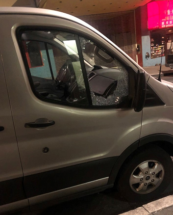
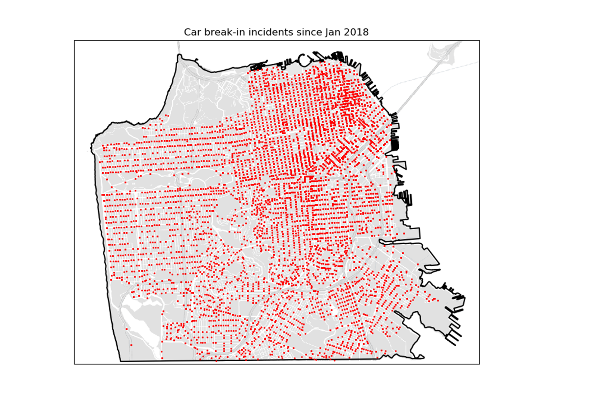
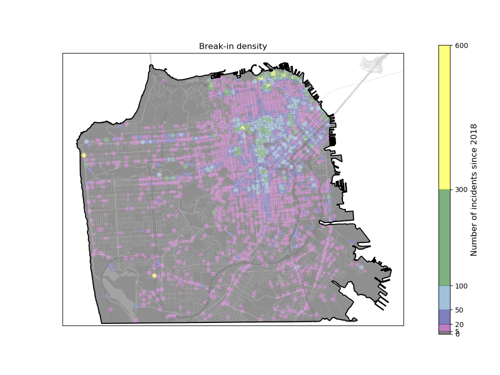
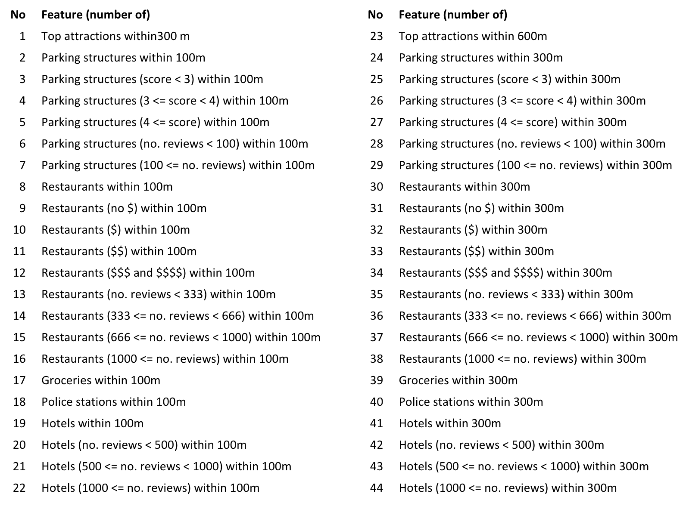
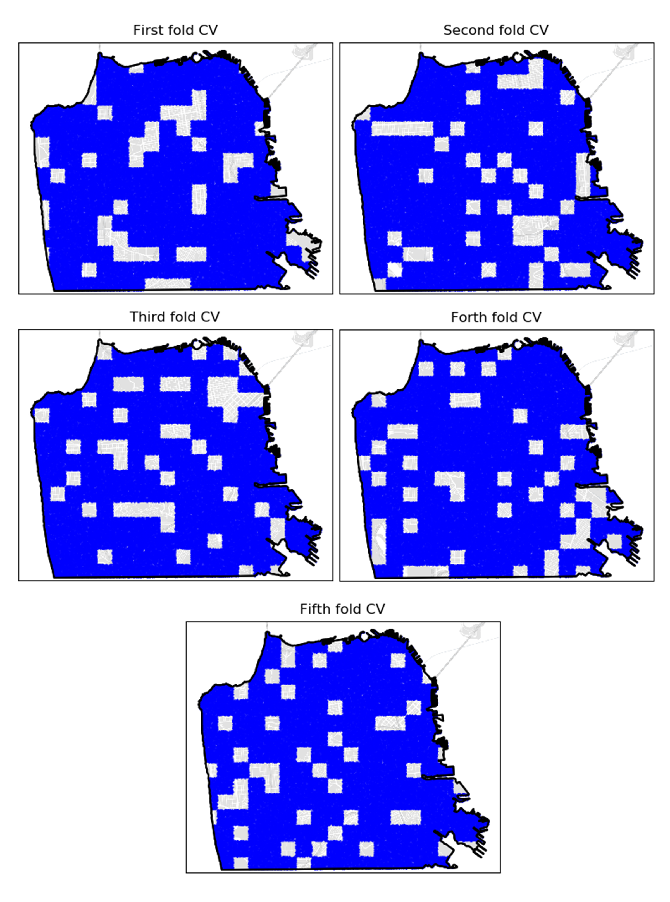
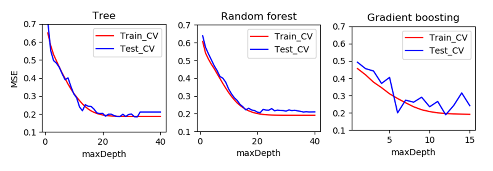
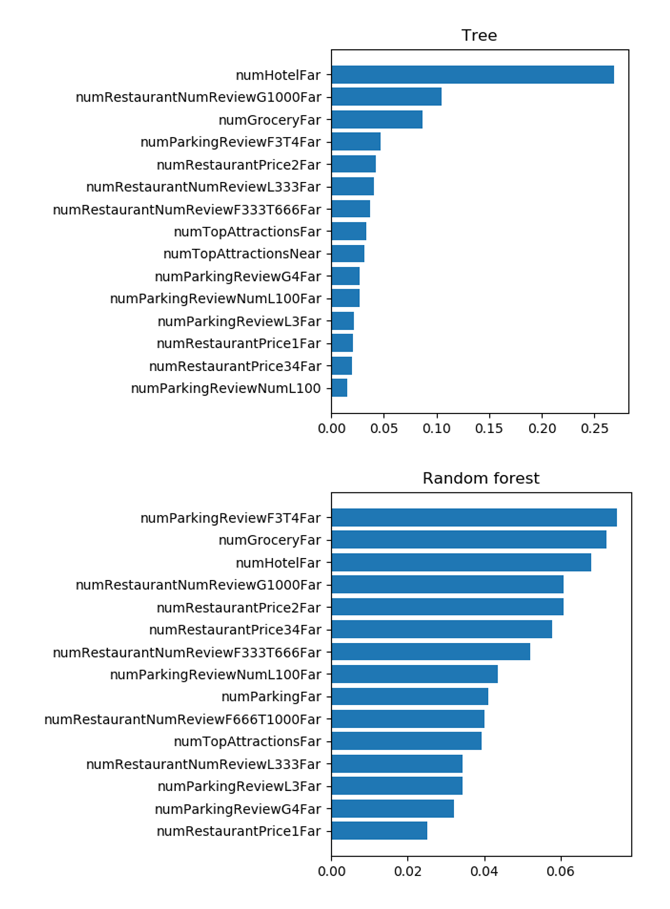
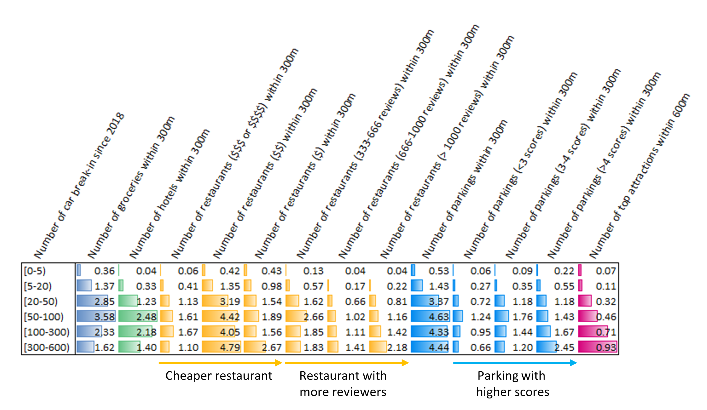

# Applying machine learning to car burglary in San Francisco
### Revealing the connections between neighborhoods and car burglary intensity

### High-lights
- Achieve 80% city-wide accuracy in identifying the intensity of car burglaries using tree and random forest models.
- Provide insights between car burglary intensity and neighborhood characteristics such as numbers of top attractions, parking structures, restaurants, and hotels.
- Exclude all features that directly discriminate based on income and demographic.

Car burglary or vehicle break-in is the most common crime in San Francisco, with an average of 71 reported incidents per day\[[1](https://projects.sfchronicle.com/trackers/sf-car-breakins/)\]. Even though car burglary usually does not lead to assault and battery, it causes extreme stress in the day-to-day lives of residents, merchants, and tourists in the city. This persistent car burglary problem continues to erode the city’s economy in addition to personal property loss.

Understanding what controls the intensity of car burglary in San Francisco is the first step for law enforcement and city planning units to alleviate the problem. It also helps insurance companies, business owners, and residents to assess the risk of car burglary in each locality. So far, the locations of high intensity are visually identified as tourist attractions such as the Pier 39, the Palace of Fine arts, and the Painted Ladies.\[[2](https://www.spotangels.com/blog/sf-parking-car-break-ins/),[3](https://projects.sfchronicle.com/2018/sf-car-breakins/)\] However, car burglary is a city-wide problem with various levels of intensity. There should be more connections between the intensity levels and the characteristics of the affected neighborhoods such as numbers of parking structures, restaurants, hotels, groceries, and police stations.

The goal of this project is to reveal the connections between neighborhood characteristics and car burglary intensity using machine learning models such as tree, random forest, and gradient boosting. The fitted models are also provided as a tool for predicting the intensity level of car burglary in San Francisco.

## Dataset

### Reported car burglary
The data of reported car burglary was queried from the SFPD incident reports website.\[[4](https://data.sfgov.org/Public-Safety/Police-Department-Incident-Reports-Historical-2003/tmnf-yvry/data)\] This project focuses on the reported incidents from Jan 2018 to Aug 2019, comprising 39,925 incidents. The reported incidents contain latitude and longitude coordinates, which were converted to UTM coordinates using the pyproj package\[[5](https://pypi.org/project/pyproj/)\].

In this project, the intensity of car burglary was defined by the number of incidents within a 100-meter radius for each location point. The picture below shows the intensity of car burglary as a density map ranging from 0 to 600 incidents. The intensity was classified into 6 levels as shown in the table below.

| Category | Level | Number of incidents within 100 m | Areal fraction (%) |
|----------|-------|----------------------------------|--------------------|
| 1 | Almost none | [0, 5) | 66.44 |
| 2 | Mild | [5, 20) | 21.73 |
| 3 | Moderate | [20, 50) | 6.97 |
| 4 | High | [50, 100) | 2.8 |
| 5 | Very high | [100, 300) | 1.91 |
| 6 | Extremely high | [300, 600) | 0.16 |

### Neighborhood characteristics

The neighborhood characteristics are defined by the numbers of top attractions, parking structures, restaurants, hotels, groceries, and police stations around each location point. The list of top 20 tourist attractions comes from the PlanetWare website\[[6](https://www.planetware.com/tourist-attractions-/san-francisco-us-ca-sf.htm)\]. Note that this project excludes the Presidio area. The addresses and review information of 691 parking structures, 1430 restaurants, 454 groceries, 182 hotels, and 26 police stations were gathered from Google maps. The addresses of these places were converted to UTM coordinates using the geopy\[[7](https://geopy.readthedocs.io/en/stable/)\] and the pyproj packages.

The locations of these places are shown along with the intensity of car burglary in the picture below. As suggested by many previous studies, neighborhoods nearby the top attractions have very high (green) or extremely high (yellow) levels of car burglary. However, not all extremely high intensity areas have top attractions nearby. Parking structures and hotels are tightly located in or near tourist attractions, downtown, and Lombard St. Restaurant locations are similar to parking structures and hotels except they also tightly distributed along main streets outside the down town area. The locations of grocery stores are roughly spread throughout the city.

In addition to locations, the review information (score, number of reviewers, and price) of those places may be connected to the intensity of car burglary. An example is the number of reviewers of restaurants as shown in the figure below. A higher number of reviewers is associated with the downtown and tourist attraction areas, which have high to extremely high car burglary intensity.

## Model setup and training

### Model setup

This project applied four machine learning models (linear regressor\[[8](https://scikit-learn.org/stable/modules/generated/sklearn.linear_model.LinearRegression.html)\], tree regressor\[[9](https://scikit-learn.org/stable/modules/generated/sklearn.tree.DecisionTreeRegressor.html)\], random forest regressor\[[10](https://scikit-learn.org/stable/modules/generated/sklearn.ensemble.RandomForestRegressor.html)\], and gradient boosting regressor\[[11](https://scikit-learn.org/stable/modules/generated/sklearn.ensemble.GradientBoostingRegressor.html)\]) to reveal the connections between neighborhood characteristics and car burglary intensity. Note that the linear regressor serves as a baseline comparison to the other three models. For all models, the outcome (Y) is the levels or ordinal classes of car burglary intensity (from 1 to 6). The features (X) are the number of previously mentioned places with their reviews information within near and far distances as summarizedin the table below. Note that the features that directly discriminate based on income and demographic are intentionally excluded in this project.

### Model training

The training of all models use the same training data points. The training data consists of 100,000 locations randomly chosen within the outline of San Francisco.\[[12](https://data.sfgov.org/Geographic-Locations-and-Boundaries/Outline-of-San-Francisco-Mask-/6tcm-n6t4)\] Each location has the features (X) and outcome (Y) as described in the previous section.

The training of the linear regressor (a baseline model) is straight forward with the total 100,000 training data points. The training of tree, random forest, and gradient boosting models employed cross-validation (CV) to fine-tune the parameters and prevent over-fitting. The five-fold CV was performed in a grid-based fashion to avoid overlapping neighborhoods, as shown in the figure below.The selection of which grid to be hold out in which fold is random.

The table below summarizes the tuning and other parameters of each model. Max depth is a common turning parameter among the three models. The mean train and test CV errors of each model as a function of max depth are shown in the figure below. As expected, the train CV error monotonically decreases with higher max depth. The optimal max depth for each model was determined by the lowest test CV error. The optimal max depth for gradient boosting is lower than that of a random forest, which is in turn lower than that of a single tree. The train and test CV errors of the three models are highly similar suggesting that the main source of fitting error comes from bias more than variance.

| Model | Tuning parameters via CV | Other parameters |
|-------|--------------------------|------------------|
| Tree | max depth = 30| |
| Random forest | max depth = 21 | max features = sqrt, number of trees = 50 |
| Gradient boosting | learning rate= 1, boosting stage = 70, max depth= 6 | max features = sqrt, subsample = 0.8 |

### Model fitting results
The figure below displays the results of the fitted linear, tree, random forest, and gradient boosting models.The fitting result of the linear model is crude as for a baseline purpose. However, the fitted tree, random forest, and gradient boosting models are able to capture almost all patterns of car burglary in the city. The models correctly identify the areas of high (blue), very high (green), and extremely high (yellow) levels of intensity. They also reach 80% city-wide accuracy. The main fitting error comes from separating almost none (black) and mild (purple) levels in the residential areas on the west side of the city. Note that gradient boosting model is less stable than the tree and random forest models, resulting slightly lower accuracy.

### Insights from the fitted models
The figure below shows the list of 15 features that have the highest feature importance in the tree and random forest models, which have the highest fitting accuracy. The feature importance measures the effectiveness in reducing the fitting error of a particular feature. There are three main observations in this figure. First, almost all of the top 15 features in each model are far-distance features that describe the number of places of interest within a 300-meter radius, compared to a 100-meter radius of the near-distance features andthe density of car burglary. This implies that car burglary intensity at each location is best explained with the neighborhood characteristics within 300m, rather than 100m. Second, there are 14 common features between the top 15 features of the tree and random forest models, indicating the low variance error in the fitting. Third, the distribution of feature importance values is more uniform in the random forest model, compared to the tree model, as expected.

Comparing the average values of the top 15 features in each intensity level offers a qualitative interpretation of the fitted model, as shown in the table below. The table also contains a bar graph for each column and is color coded with the type of buildings for the purpose of visualization. Here is the list of interpretations from this table.

- An almost none (0-5) level of car burglary is associated with very low numbers of grocery stores, hotels, restaurants, parking structures, and top attractions. This is characteristics of residential areas.
- A small increases in the number of the amenities listed above leads to a mild (5-20) level of car burglary. This is characteristics of the main streets in residential areas or densly popuulated residential areas.
- A moderate (20-50) level of car burglary occurs when there are significant increases in the numbers of grocery stores, hotels, restaurants, parking structures, and top attractions. This are characteristics of the boarders of busy commercial areas.
- A high (50-100) level of car burglary has the highest numbers of groceries, hotels, and parking structures. This is a characteristic of the busy commercial area.
- A very high (100-300) level of car burglary is associated with increasing numbers of tourist attractions and restaurants with higher numbers of reviewers. This is characteristic of busy commercial areas that are around tourist attractions.
- An extremely high (300-600) level of car burglary is associated with highest numbers of top attractions and restaurants with inexpensive (one $) or the highest number of reviewers. This is characteristic of the parking structures near top attractions and big shopping centers.

One counter-intuitive finding is that parking structures with higher review scores have higher numbers of car burglaries. It is possible that parking structures with higher scores have more parked cars inside resulting in a higher number of incidents. Also, the presence of police station does not statiscally affected the intensity level of car burglary.

## Summary

This project reveals the connection between the intensity levels of car burglary and neighborhood characteristics such as the numbers of parking structures, restaurants, hotels, grocery stores, and police stations. This project also achieves 80% city-wide accuracy in classifying the intensity levels using tree and random forest models.

## Author

* **Krongrath Suwannasri** - *Ph.D. candidate at Stanford University*

## License

This project is licensed under the MIT License - see the [LICENSE.md](LICENSE.md) file for details

## Acknowledgments

I would like to thanks Jerome H. Friedman, Tee Ponsukcharoen, and Navi Tansaraviput for feedbacks on this project.
